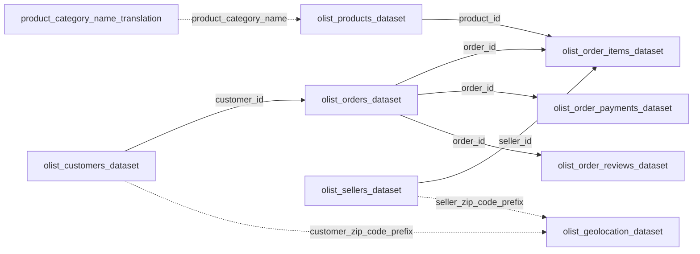

# Exploração inicial — dataset público da Olist

Contagens feitas com o módulo `csv` do Python sobre os arquivos em `Olist/dados/`. Cada número abaixo é um registro lido do CSV. Somas em reais usam `Decimal`. O dicionário das colunas está em [dados.md](dados.md).

## Sumário

A base pública da Olist tem 9 tabelas e 99.441 pedidos. A compra mais antiga é 2016-09-04 21:15:19 e a mais recente é 2018-10-17 17:30:18. O pedido é o centro do desenho: `customer_id` liga um cliente a um pedido, e itens, pagamentos e avaliações entram por `order_id`.

Três quebras mudam o uso dos indicadores. Há 775 pedidos sem nenhum item, e esses pedidos somam R$ 162.591,95 em pagamentos. Outros 303 pedidos têm itens e pagamento, mas a soma de preço e frete não fecha com o valor pago (diferença absoluta total de R$ 3.269,22). Há 1.411 pedidos com data de marco fora de ordem ou com status incompatível com a data de entrega. No catálogo, 610 produtos estão sem categoria; na geolocalização, 261.831 linhas são cópias exatas e 8 prefixos de CEP aparecem em mais de um estado.

As três recomendações no final tratam desses achados: conciliar venda antes de publicar receita, travar o cálculo de prazo nas datas inconsistentes e separar categoria vazia e CEP excepcional nas visões de sortimento e praça.

## Tabelas e registros

São 9 tabelas.

| Arquivo | Registros |
| --- | ---: |
| `olist_customers_dataset.csv` | 99.441 |
| `olist_geolocation_dataset.csv` | 1.000.163 |
| `olist_order_items_dataset.csv` | 112.650 |
| `olist_order_payments_dataset.csv` | 103.886 |
| `olist_order_reviews_dataset.csv` | 99.224 |
| `olist_orders_dataset.csv` | 99.441 |
| `olist_products_dataset.csv` | 32.951 |
| `olist_sellers_dataset.csv` | 3.095 |
| `product_category_name_translation.csv` | 71 |
| **Total de registros** | **1.550.922** |

O grão não é o mesmo em todas. Cliente, pedido, produto e vendedor têm uma linha por identificador (`customer_id`, `order_id`, `product_id`, `seller_id`). Item, pagamento e avaliação têm várias linhas por pedido. A geolocalização tem várias linhas por prefixo de CEP.

`customer_unique_id` identifica a pessoa por trás do pedido: são 96.096 valores distintos em 99.441 linhas. Desses, 2.997 (3,12%) aparecem em mais de um pedido. O máximo é 17 pedidos para o mesmo identificador.

## Arquitetura dos dados

As setas contínuas são chaves conferidas coluna a coluna: todo valor do lado filho existe no lado pai. As setas tracejadas existem nas colunas, com falhas de cobertura medidas mais abaixo.

O que a conferência das chaves mostrou:

- `customer_id` tem 99.441 valores nos dois arquivos, sem falha. Nesta extração a relação é um cliente de pedido para um pedido.
- Todo `order_id` de item, pagamento e avaliação existe em pedidos. O caminho inverso falha: 775 pedidos não têm item, 1 pedido não tem pagamento e 768 pedidos não têm avaliação.
- Todo `product_id` dos itens existe em produtos (32.951 nos dois lados). Todo `seller_id` dos itens existe em vendedores (3.095 nos dois lados).
- A tradução de categoria não cobre todos os nomes usados em produtos. O prefixo de CEP não cobre todos os clientes nem todos os vendedores.

## Pedido, item e pagamento

Dos 99.441 pedidos, 96.478 estão `delivered`. O restante se divide em `shipped` (1.107), `canceled` (625), `unavailable` (609), `invoiced` (314), `processing` (301), `created` (5) e `approved` (2).

O pedido com item e o pedido com pagamento não são o mesmo conjunto. 98.665 pedidos têm os dois. 775 têm pagamento e nenhum item. 1 tem itens e nenhum pagamento. Nenhum pedido fica sem os dois ao mesmo tempo.

Os 775 sem item concentram-se em status que não chegaram a uma venda concluída: `unavailable` (603), `canceled` (164), `created` (5), `invoiced` (2) e `shipped` (1). Ainda assim, as linhas de pagamento desses pedidos somam R$ 162.591,95. Um indicador de venda que some `payment_value` sem exigir item conta esse valor.

O pedido sem pagamento é o `bfbd0f9bdef84302105ad712db648a6c`, status `delivered`, com preço mais frete de R$ 143,46.

Nos 98.665 pedidos com item e pagamento, a soma de `price` + `freight_value` foi comparada à soma de `payment_value`. Em 303 pedidos a diferença absoluta passa de R$ 0,01. A soma dessas diferenças é R$ 3.269,22. Em 264 o pagamento é maior; em 39 a soma dos itens é maior. A diferença líquida é R$ 2.871,06 a favor do pagamento. A maior diferença num único pedido é R$ 182,81. São 0,31% dos pedidos conciliáveis, com efeito pequeno diante do volume, e grande o bastante para deslocar um fechamento de receita se entrar na soma.

Há 2.961 pedidos com mais de uma linha de pagamento. Os meios nas 103.886 linhas são `credit_card` (76.795), `boleto` (19.784), `voucher` (5.775), `debit_card` (1.529) e `not_defined` (3). As três linhas `not_defined` valem R$ 0,00 e pertencem a pedidos `canceled`. Outras 6 linhas de `voucher` também valem R$ 0,00, dentro de pedidos que têm mais pagamentos. Duas linhas de `credit_card` trazem `payment_installments` igual a 0. O intervalo observado de parcelas vai de 0 a 24. Não há preço, frete nem pagamento negativo. Não há item com preço zero.

## Status e datas

Datas vazias acompanham, em grande parte, o status. Pedido `shipped` não traz entrega ao cliente (1.107 de 1.107). Pedidos `invoiced`, `processing` e `unavailable` não trazem entrega à transportadora nem ao cliente. A data estimada está preenchida nos 99.441 pedidos.

O que foge desse desenho:

- 1.359 pedidos têm entrega à transportadora anterior à aprovação.
- 166 têm entrega à transportadora anterior à compra.
- 61 têm entrega ao cliente anterior à aprovação.
- 23 têm entrega ao cliente anterior à entrega à transportadora.
- 8 pedidos `delivered` não têm data de entrega ao cliente, 2 não têm data de entrega à transportadora e 14 não têm data de aprovação.
- 6 pedidos `canceled` têm data de entrega ao cliente. São os únicos pedidos fora de `delivered` com essa data preenchida.

Nenhuma aprovação é anterior à compra. Nenhuma entrega ao cliente é anterior à compra. Nenhuma data estimada é anterior à compra. Nenhuma `shipping_limit_date` de item é anterior à compra.

Juntando as seis quebras da lista acima, 1.411 pedidos (1,42% de 99.441) caem em ao menos uma. O total não é a soma das linhas, porque o mesmo pedido pode falhar em mais de um teste. Qualquer prazo médio calculado em cima do arquivo inteiro mistura esses casos com entregas cuja sequência de datas é utilizável.

## Catálogo

São 32.951 produtos e 71 traduções de categoria. Em produtos há 73 textos distintos de categoria, contando o vazio.

610 produtos (1,85%) estão com `product_category_name`, `product_name_lenght`, `product_description_lenght` e `product_photos_qty` vazios ao mesmo tempo. Esses produtos entram em 1.603 itens (1,42% de 112.650) e em 1.451 pedidos (1,46% de 99.441). Uma visão de venda por categoria deixa esse bloco de fora, ou o joga numa classe vazia, conforme a regra de agregação.

Dois nomes de categoria não têm linha na tradução: `pc_gamer` (3 produtos) e `portateis_cozinha_e_preparadores_de_alimentos` (10 produtos). Juntos são 13 produtos, 24 itens e 22 pedidos.

Dois produtos estão sem peso e sem as três dimensões. Em um deles a categoria também está vazia.

## Avaliações

Há 99.224 linhas de avaliação para 98.673 pedidos. 768 pedidos não têm avaliação (0,77%), dos quais 646 estão `delivered`. Entre os pedidos com avaliação, 98.126 têm uma linha, 543 têm duas e 4 têm três.

A nota registrada se concentra no topo da escala e tem uma cauda relevante na nota mínima:

| Nota | Registros |
| --- | ---: |
| 5 | 57.328 |
| 4 | 19.142 |
| 3 | 8.179 |
| 2 | 3.151 |
| 1 | 11.424 |

A nota 5 é 57,78% das linhas. A nota 1 é 11,51%. O texto é bem mais raro que a nota: 58.247 mensagens estão vazias (58,70%) e 87.656 títulos estão vazios (88,35%). Uma leitura de satisfação por nota cobre quase todos os pedidos avaliados. Uma leitura por comentário cobre só a parte que escreveu.

O identificador da avaliação não serve como chave. Há 98.410 `review_id` distintos em 99.224 linhas. 789 identificadores se repetem e geram 814 linhas extras. O máximo é 3 ocorrências. Nos 789 casos, o mesmo `review_id` aparece em pedidos diferentes.

Nenhuma resposta da pesquisa é anterior à data de criação da avaliação.

## Praça e geolocalização

A tabela geográfica tem 1.000.163 linhas e 19.015 prefixos distintos. 17.972 prefixos têm mais de uma linha. O prefixo mais repetido tem 1.146 linhas. Esse é o grão publicado: vários pontos por CEP, não um ponto por CEP.

261.831 linhas repetem outra linha nas cinco colunas (26,18% do arquivo). Sem essas cópias, ficam 738.332 combinações distintas de prefixo, latitude, longitude, cidade e estado. 8.556 prefixos têm mais de uma grafia de cidade. 8 prefixos têm mais de um estado.

Dos 14.994 prefixos de clientes, 157 não existem na geolocalização. Isso atinge 278 clientes (0,28% de 99.441). Dos vendedores, 7 prefixos e 7 cadastros ficam de fora. Onde o prefixo existe, o nome da cidade ainda diverge do conjunto de `geolocation_city` daquele CEP em 40 clientes e 98 vendedores. Depois de tirar acento, passar a minúsculas e colapsar espaços, restam 24 clientes e 90 vendedores com cidade diferente.

Estado de cliente e de vendedor está preenchido e tem 2 caracteres em todas as linhas.

## Métricas que estes dados permitem explorar

As colunas sustentam um painel operacional. Esta leitura não calculou esses indicadores; só confirma que o campo existe e aponta a trava vista acima.

- Volume de pedidos, itens e pedidos por pessoa (`customer_unique_id`).
- Receita de itens (`price`), frete (`freight_value`) e valor pago (`payment_value`), depois da conciliação.
- Mix de meio de pagamento e de parcelas.
- Prazo realizado contra `order_estimated_delivery_date`, para pedidos com a sequência de datas íntegra.
- Cumprimento de `shipping_limit_date` por vendedor.
- Nota da pesquisa e taxa de comentário preenchido.
- Venda e nota por categoria, com classe à parte para categoria vazia e para as duas categorias sem tradução.
- Concentração por vendedor, UF e prefixo de CEP, com os prefixos sem coordenada e os 8 prefixos de estado conflitante fora da média geográfica.

## Processos que estes dados podem acompanhar

A página do dataset descreve a operação da Olist Store: o lojista vende pelo marketplace, é avisado para cumprir o pedido e despacha com o parceiro logístico; o cliente recebe a pesquisa quando o produto chega ou quando a data estimada vence. As tabelas cobrem esse ciclo.

- **Captação do pedido.** Compra, status e cliente.
- **Pagamento.** Aprovação, meio, parcelas e valor.
- **Fulfillment do vendedor.** Item, vendedor e data limite de envio.
- **Entrega.** Passagem à transportadora, entrega ao cliente, data estimada e frete.
- **Pós-venda.** Nota e comentário da pesquisa.
- **Sortimento.** Categoria, fotos, textos e medidas do produto.
- **Rede e praça.** Cadastro do vendedor, UF do cliente e coordenadas do CEP.

## Anomalias

Cada linha foi contada nos CSV. Onde o mesmo pedido entra em mais de um teste de data, as magnitudes não se somam. O conjunto único desses testes de data e de status tem 1.411 pedidos.

| O quê | Onde | Magnitude |
| --- | --- | --- |
| Pedido sem item, com pagamento lançado | `olist_orders_dataset` sem linha em `olist_order_items_dataset` | 775 pedidos (0,78%). Status: `unavailable` 603, `canceled` 164, `created` 5, `invoiced` 2, `shipped` 1. Pagamentos desses pedidos: R$ 162.591,95 |
| Pedido entregue com item e sem pagamento | `order_id` `bfbd0f9bdef84302105ad712db648a6c` | 1 pedido `delivered`. Preço + frete: R$ 143,46 |
| Pagamento diferente de preço + frete em mais de R$ 0,01 | Pedidos com ao menos um item e um pagamento | 303 de 98.665. Soma das diferenças absolutas: R$ 3.269,22. Pagamento maior em 264; itens maiores em 39. Diferença líquida: R$ 2.871,06. Máximo num pedido: R$ 182,81 |
| Meio de pagamento indefinido e valor zero | `payment_type` = `not_defined` | 3 linhas, todas de pedidos `canceled`, valor R$ 0,00 |
| Valor de pagamento zero em voucher | `payment_value` = 0 em linha `voucher` | 6 linhas, dentro de pedidos que têm outras linhas de pagamento |
| Parcelas iguais a zero | `payment_installments` = 0 | 2 linhas de `credit_card`, ambas com `payment_sequential` 2 |
| Entrega à transportadora anterior à aprovação | `order_delivered_carrier_date` anterior a `order_approved_at` | 1.359 pedidos |
| Entrega à transportadora anterior à compra | `order_delivered_carrier_date` anterior a `order_purchase_timestamp` | 166 pedidos |
| Entrega ao cliente anterior à aprovação | `order_delivered_customer_date` anterior a `order_approved_at` | 61 pedidos |
| Entrega ao cliente anterior à transportadora | `order_delivered_customer_date` anterior a `order_delivered_carrier_date` | 23 pedidos |
| Status `delivered` sem data de entrega ao cliente | `order_delivered_customer_date` vazio | 8 de 96.478 |
| Status `delivered` sem entrega à transportadora | `order_delivered_carrier_date` vazio | 2 de 96.478 |
| Status `delivered` sem aprovação | `order_approved_at` vazio | 14 de 96.478 |
| Cancelado com data de entrega ao cliente | `order_status` = `canceled` e data de entrega preenchida | 6 de 625 |
| `review_id` repetido em pedidos diferentes | `olist_order_reviews_dataset` | 789 identificadores; 814 linhas além dos ids distintos; máximo de 3 ocorrências |
| Produto sem categoria e sem atributos de nome, descrição e fotos | As quatro colunas vazias no mesmo produto | 610 produtos (1,85%), em 1.603 itens e 1.451 pedidos |
| Categoria sem tradução | `pc_gamer`; `portateis_cozinha_e_preparadores_de_alimentos` | 13 produtos (3 e 10), 24 itens, 22 pedidos |
| Produto sem peso e sem dimensões | `product_weight_g` e as três medidas em cm vazios | 2 produtos; em 1 a categoria também está vazia |
| CEP de cliente ausente na geolocalização | `customer_zip_code_prefix` | 278 clientes em 157 prefixos |
| CEP de vendedor ausente na geolocalização | `seller_zip_code_prefix` | 7 vendedores em 7 prefixos |
| Cidade do cadastro diferente das cidades do CEP | Texto de cidade contra `geolocation_city` do mesmo prefixo | 40 clientes (24 após ignorar acento e maiúsculas) e 98 vendedores (90 após o mesmo tratamento) |
| Linha de geolocalização idêntica a outra | As cinco colunas iguais | 261.831 linhas (26,18% de 1.000.163) |
| Várias grafias de cidade no mesmo prefixo | `geolocation_city` | 8.556 prefixos |
| Mais de um estado no mesmo prefixo | `geolocation_state` | 8 prefixos |

## Recomendações

1. **Publicar venda só com pedido conciliado.** O achado é o bloco de 775 pedidos sem item (R$ 162.591,95 em pagamentos), o pedido entregue de R$ 143,46 sem pagamento e os 303 pedidos em que preço mais frete não fecha com o valor pago. O indicador de receita deve somar apenas pedidos em que existem itens e a diferença absoluta fica até R$ 0,01. Os 775 sem item ficam num controle de pagamento sem venda, fora do ticket e fora da receita de mercadoria.

2. **Medir prazo só com a sequência de datas íntegra.** O achado é o conjunto de 1.411 pedidos em que a entrega à transportadora ou ao cliente está fora de ordem, ou em que o status `delivered` ou `canceled` não combina com as datas. O atraso contra a data estimada e o cumprimento da data limite do vendedor devem excluir esses pedidos até a data ser corrigida. O recorte utilizável é o pedido em que compra, aprovação, transportadora e cliente respeitam essa ordem e o status `delivered` tem as três datas preenchidas.

3. **Separar buraco de cadastro nas visões de categoria e de praça.** O achado de sortimento é o conjunto de 610 produtos sem categoria (1.603 itens, 1.451 pedidos) mais as duas categorias sem tradução (13 produtos, 24 itens). O achado de praça é o de 278 clientes e 7 vendedores sem coordenada, 8 prefixos com mais de um estado e 261.831 linhas geográficas repetidas. Categoria vazia entra como classe própria, com as duas categorias sem inglês listadas pelo nome em português. Mapa e praça agregam a geolocalização por prefixo, descartam a cópia idêntica e tiram da média os 8 prefixos com estado conflitante e os CEP sem correspondência.
